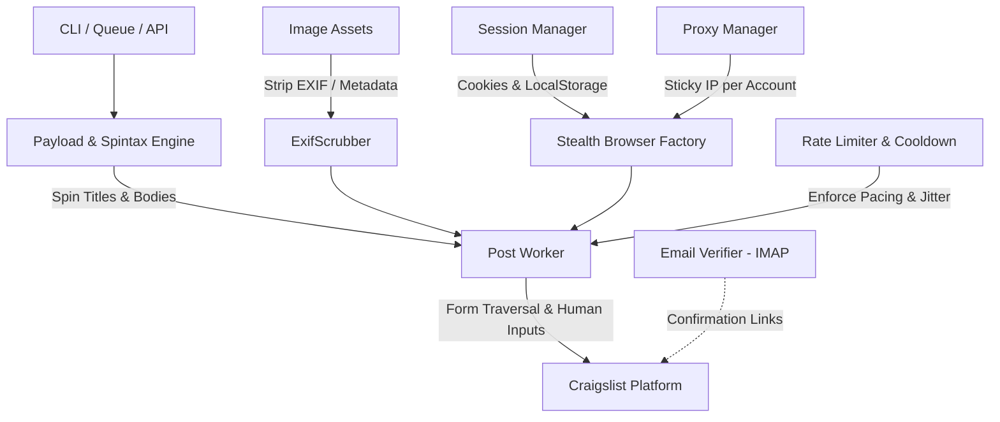

# Craigslist Poster Pro 🚀

A scalable, stealth automated Craigslist posting engine built with **Playwright**, anti-detect browser signatures, recursive spintax generation, EXIF metadata sanitization, sticky proxy routing, and intelligent rate limiting.

Synthesizes the best architecture from:
- `notmike101/craigslist-poster`: Spintax rotation, payload schema, DOM navigation.
- `alex1115alex/CraigslistBot`: Account lifecycle, retry resilience, automated IMAP email confirmation.
- `bunlongheng/cl-poster`: Modern Playwright engine, stealth browser context, cooldown timers, batch queueing.

---

## 🏗️ 1. Architecture Overview



### Modular Directory Structure

```text
craigslist-poster/
├── config/
│   ├── settings.py           # Pydantic configuration loader
│   └── default_config.yaml   # Config file for pacing, stealth, & proxies
├── core/
│   ├── browser.py            # Playwright stealth factory + human typing & bezier curves
│   ├── session.py            # Cookie and storage-state persistence manager
│   ├── proxy.py              # Sticky proxy session manager (Oxylabs, Bright Data, etc.)
│   └── rate_limiter.py       # Cooldown enforcement & rate pacing manager
├── payload/
│   ├── models.py             # Pydantic models for PostPayload, Account, JobResult
│   ├── spintax.py            # Recursive nested Spintax parser & variant generator
│   └── exif_scrubber.py      # EXIF metadata cleaner & image re-encoder
├── workers/
│   ├── poster.py             # Primary Craigslist posting worker with selector fallbacks
│   └── email_verifier.py     # Automated IMAP email confirmation listener
├── data/
│   ├── sessions/             # Cached session states & cookies (.json)
│   ├── templates/            # JSON post templates with spintax
│   └── images/               # Raw and processed images
├── tests/
│   ├── test_spintax.py       # Unit tests for spintax parser
│   └── test_exif.py          # Unit tests for image scrubber
├── main.py                   # Unified CLI runner (dry-run, post, spin, clean-images)
├── pyproject.toml            # Project packaging specification
├── requirements.txt          # Python dependencies
└── README.md                 # System documentation & architectural plan
```

---

## 📋 2. Step-by-Step Implementation Plan

### Phase 1: Core Setup & Dependency Hardening
- [x] Configure Playwright with Chromium stealth flags (`--disable-blink-features=AutomationControlled`, randomized viewport profiles, dynamic user-agents).
- [x] Integrate `playwright-stealth` and JavaScript evasion scripts (overriding `navigator.webdriver`, `chrome.runtime`, `navigator.languages`).
- [x] Implement human-like interaction heuristics:
  - Character-by-character typing with Gaussian randomized delays.
  - Organic cursor movement using Quadratic Bézier curves with micro-jitter.

### Phase 2: Content Obfuscation & Image Sanitization
- [x] Build recursive `SpintaxParser` supporting unlimited bracket nesting (e.g. `{Top {tier|quality}|Premium} item`).
- [x] Implement `ExifScrubber` using Pillow to wipe GPS, camera serials, timestamps, and re-encode images to reset perceptual image hashing.

### Phase 3: Session Persistence & Proxy Routing
- [x] Implement `SessionManager` to load/save Playwright storage state (`storage_state.json`) per account.
- [x] Build `ProxyManager` to support residential/mobile proxy endpoints with account-sticky session IDs.

### Phase 4: Posting Workflow Navigation & Resilient Selectors
- [x] Implement dynamic posting path:
  1. Subdomain entry (`https://{city}.craigslist.org/`) -> Craigslist Post selector.
  2. Post category selection (`for sale by owner`, `services`, `housing`).
  3. Sub-area navigation (for multi-region metros like SF Bay Area or NYC).
  4. Specific subcategory selection (`electronics`, `furniture`, `general`).
  5. Form population with robust multi-selector fallbacks (`#PostingTitle`, text-matching, regex).
  6. Location / Map confirmation screen bypass.
  7. Automated image upload with sanitized assets.
  8. Preview inspection & Dry-Run simulation.
  9. Final publication with confirmation receipt & error logging.

### Phase 5: Safety Layer & Rate Limiting
- [x] Implement `RateLimiter` with jittered cooldown intervals between posts and maximum daily limits.
- [x] Provide automated IMAP `EmailVerifier` to handle Craigslist email-confirmation links when guest posting.

---

## ⚡ 3. Quickstart & Usage

### Installation

```bash
# Clone the repository
git clone <your-repo-url>
cd craigslist-poster

# Create a virtual environment
python -m venv .venv
source .venv/bin/activate  # On Windows: .venv\Scripts\activate

# Install dependencies and Playwright browser
pip install -r requirements.txt
playwright install chromium
```

### Control Panel & Session Management

#### Interactive Control Panel
Launch the visual interactive terminal menu:
```powershell
python menu.py
```

#### One-Time Login Session Saver
Establish a persistent authenticated session so the browser stays logged in across all future runs:
```powershell
python save_session.py
```

#### Run Dry-Run Preview Test
```powershell
python dry_run_harness.py
```

#### Preview Spintax Variations
```powershell
python main.py spin --text "{Brand New|Factory Sealed} {iPhone 15|Galaxy S24} {Ready for pickup|Local cash}" --count 4
```

#### Run Unit Tests
```powershell
python -m unittest discover -s tests
```

---

## 🛡️ Anti-Bot & Operational Best Practices

1. **Proxy Hygiene**: Always use clean residential or mobile proxies (e.g. Bright Data, Oxylabs, Soax) pinned to the geographical area/city of the target Craigslist subdomain.
2. **Pacing**: Maintain at least 3-7 minutes of randomized cooldown between successive posts on the same IP.
3. **Spintax Depth**: Keep your spintax tree deep enough so that no two ads have greater than 30% lexical overlap.
4. **Image Uniqueness**: Avoid stock photos. Always pass images through the `ExifScrubber` before uploading.
